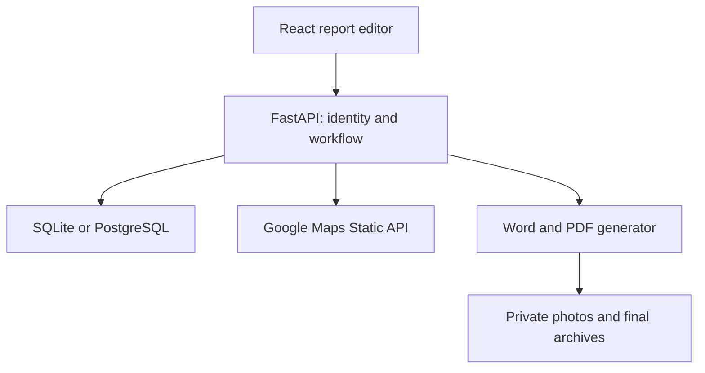

# Architecture and operating model

The browser never receives the Google server key. All report, photo, history, map and export endpoints check report ownership. UUID identifiers are not relied on as authentication.

## Tables

- `users`: normalised email, Argon2 password hash and reusable valuer profile.
- `banks`: bank-profile JSON owned by a user.
- `reports`: owning user, validated JSON, status, optimistic revision, timestamps and archive key.
- `assets`: caption and internal photo filename, associated with a report.
- `events`: input snapshot, actor, action, revision and timestamp.

Reports store snapshots of bank/valuer details. Updating a profile cannot silently change an existing report. Saving a report or changing photos increments its revision and returns it to draft. SQLAlchemy includes the revision in update predicates to detect competing writes.

## Finalisation

1. Check ownership, expected revision, review status and required fields.
2. Render a final-labelled DOCX using the saved report inputs.
3. Convert that exact document to PDF in an isolated temporary LibreOffice profile.
4. Store DOCX/PDF plus an input and SHA-256 manifest in a new private archive folder.
5. Commit the locked final status and approval event. Delete the new folder if finalisation fails.
6. Serve the archived bytes for later final downloads.

This is application-level immutability. A privileged server/database administrator can still alter storage. If tamper-evident regulatory archives are required, add signed manifests, append-only logs, object lock and independent audit controls.

## Main API routes

| Method | Route | Purpose |
| --- | --- | --- |
| POST | `/api/auth/register`, `/api/auth/login` | Account onboarding/sign-in |
| GET/PUT | `/api/profile` | Current valuer profile |
| GET/POST | `/api/banks` | Reusable bank profiles |
| PUT | `/api/banks/{id}` | Update an owned bank profile |
| GET/POST | `/api/reports` | List/create reports |
| GET/PUT | `/api/reports/{id}` | Read/save report inputs |
| POST | `/api/reports/{id}/calculate` | Decimal results and review issues |
| POST | `/api/reports/{id}/review` | Move validated saved report to review |
| POST | `/api/reports/{id}/finalise` | Record approval and archive |
| POST | `/api/reports/{id}/copy` | Revised draft for the same property |
| GET | `/api/reports/{id}/map` | Authenticated map preview |
| GET/POST | `/api/reports/{id}/photos` | List/upload inspection photos |
| GET/DELETE | `/api/reports/{id}/photos/{asset_id}` | Read/remove photo reference |
| GET | `/api/reports/{id}/export/{docx or pdf}` | Draft generation or archived final download |
| GET | `/api/reports/{id}/history` | Audit event list |
| GET | `/api/reports/{id}/history/{event_id}` | Saved input snapshot |

Open `/docs` on the local backend for generated request schemas. No report files are served from a public static folder.

## Deliberate MVP boundaries

- Single valuer owns and approves their reports; separate reviewer/admin team roles are not included.
- The report register returns the most recent 200 records. Add pagination before larger-scale use.
- Photo files can remain after removal because previous report copies may reference them. Implement a coordinated retention/deletion process before commercial use.
- Input history records all report fields, but it is not a complete historical attachment reconstruction UI.
- Bank-profile editing exists in the API; the UI loads profiles and saves new profiles. A full bank-management screen is a future extension.
- Export jobs run synchronously; there is no background queue.
- Approval requires real PDF conversion, so test the server's LibreOffice environment.
- No payments, email delivery, AI, GPS surveying, market-data scraping or automatic property valuation is implemented.
- No external sharing or report-emailing feature is enabled.

## No-Docker runtime

Development uses Vite on 127.0.0.1:5173 and uvicorn on 127.0.0.1:8000. After `npm run build`, a newly started FastAPI process mounts `frontend/dist` at `/` after the API routes, using Starlette StaticFiles. Only compiled interface assets are exposed there. Report storage remains outside that mount. Local settings are read from `backend/.env` because launch scripts use `backend` as their working directory. SQLite is the default; PostgreSQL's driver is optional.

Static serving reference: https://fastapi.tiangolo.com/tutorial/static-files/
